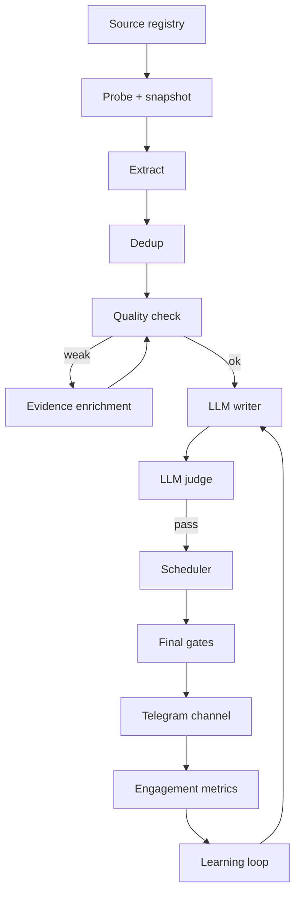
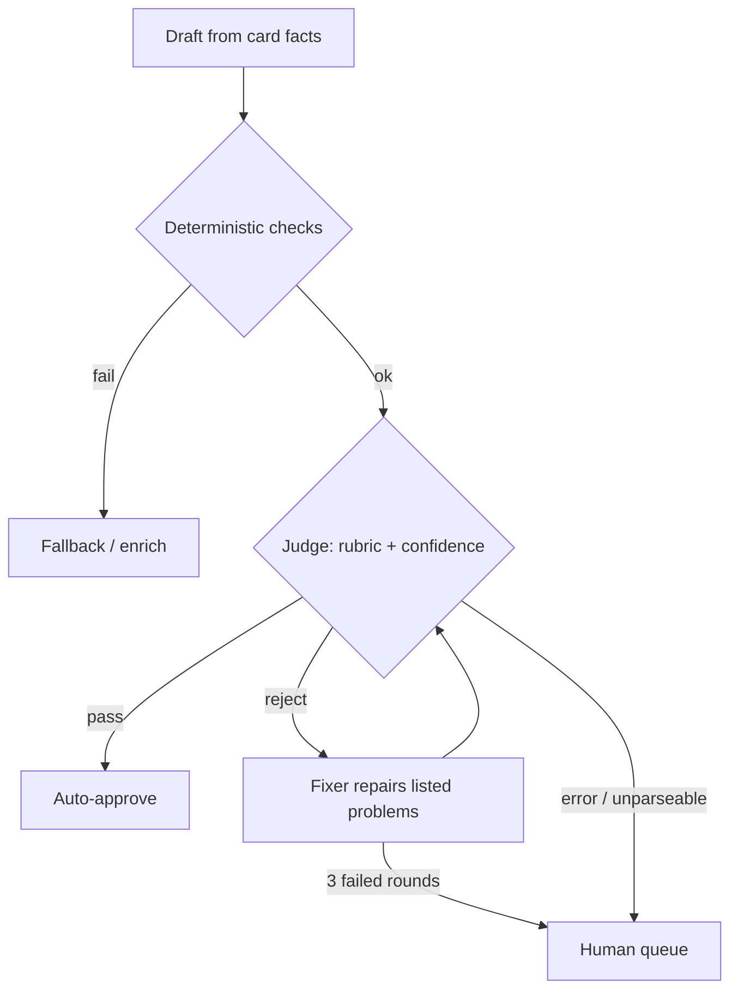
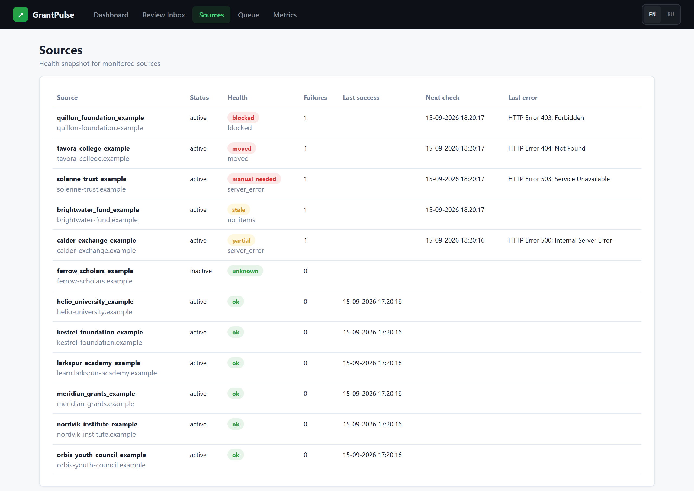

# GrantPulse

An editorial pipeline that finds scholarships, grants and internships for young people and publishes checked, source-backed posts to a Telegram channel.

**Jun 2026 – Jul 2026 · 42 commits · Python · SQLite · code: private**
## The problem

There are thousands of opportunities for students — fully funded master's programmes, UN internships, summer schools, fellowships, competitions — and they are scattered across university sites, international organisations and government portals. Russian-speaking students in the CIS and Central Asia mostly learn about them from Telegram channels. Those channels often repost each other, drop the official link, get deadlines wrong, or promise "fully funded" without proof.

A useful channel has to publish several posts every day, and each post has to be true. Doing that by hand does not scale. Doing it with a naive scraper plus a language model produces confident nonsense.

## What it does

- Monitors a curated registry of 89 official and aggregator sources. Most are universities, international organisations and government scholarship programmes, and each has a priority and a reliability rating.
- Turns raw pages into structured opportunity records: title, official URL, deadline, country, level, funding, eligibility and summary. It removes duplicates across sources.
- Scores every candidate. Weak candidates go to enrichment, which reads the official page and fills in missing facts, but only with a verbatim quote as evidence.
- Writes each post in Russian, in a fixed house style, using only facts it holds for that record. An independent reviewer model then checks the post against a rubric before anything is approved.
- Schedules posts at human-looking times, deletes its own mistakes within tight limits, and collects views and reactions so later posts improve.
- Gives the operator two control surfaces: a local web console for reviewing cards, and a private Telegram bot with approve, redraft and publish buttons.

## How it works

Every stage writes its evidence to SQLite: raw items with content hashes, field-level evidence snippets, quality labels, review actions and publication attempts. Any decision can be traced back to the page it came from.

## Engineering notes

- **Snapshots for auditability.** Every fetched page is stored on disk under a content-hash name and linked from its database row. A listing that later disappears or changes can still be checked against what the system actually saw. Over the project's life this built up several thousand captured pages.
- **Two LLM backends behind one interface.** A single client talks to either the official Anthropic SDK or a headless Claude Code CLI, chosen automatically. Both enforce JSON schemas for verdicts, so no model output is parsed with regexes. Every call is logged with its duration and cost.
- **The judge is stronger than the writer, and fails closed.** A different, larger model reviews each post. Output it cannot parse counts as a rejection, while transport failures are retried without penalty. If rejections spike, a circuit breaker pauses auto-approval and alerts the operator.
- **Data-quality fixes found in production.** Some records had the official URL stored as their title and summary. They now fall back to the page's meta title or a readable URL slug. Deadline suffixes are stripped from titles. A writer that listed unknown fields as "not specified" lines is now blocked at the final send gate, not only at approval.
- **Defence in depth on publishing.** Publishing requires two approved states: one for the candidate and one for the post. The checks run again at scheduling and again at send time, including a deadline-expiry check in case a deadline passes while the post sits in the queue.
- **One brain, many processes.** A database heartbeat and an explicit dispatch owner stop two machines, or two components, from publishing the same queue. A test that races two threads proves only one of them can claim a due post.
- **Found by audit and lint, not by luck.** An adversarial review uncovered approved posts being silently stranded by duplicate draft rows. Enabling a linter exposed an enrichment step that had been failing silently for a week. Both now have regression tests.

## How it is verified

- 29 offline test modules with about 190 test functions. The tests use temporary SQLite databases and swap in stub LLM calls, so they need no network access.
- Lint (ruff) and tests run together as a single `make check`. It was recorded green at the end of each of the last four development sprints.
- Changes to LLM behaviour were tested live against real candidates before they shipped. For example, three models were compared on the same guardrails before a default was chosen, and enrichment runs were checked for invented facts.
- Destructive actions (publishing, deleting) are dry-run by default and audited. Before any deletion a local backup is written, and there is a per-run cap.

## Stack

Python 3.10+, SQLite (WAL mode, versioned migrations), Telegram Bot API, Telethon (engagement metrics), the Anthropic Python SDK and Claude Code CLI, Pillow, pytest, ruff. It runs on macOS under launchd, and a systemd unit is included for a Linux VPS.

## Screenshots

_The real code running on synthetic data. No client data appears anywhere._

*A candidate card in the GrantPulse review console, rendered by the real code from synthetic data: extracted fields, a deterministic quality score with its labels, field-level evidence snippets taken from the (fictional) official page, and the template-generated Russian draft post beside them.*

*The console's source health page after a real probe run against fictional sources: blocked, moved, server-error, stale, partial and ok states, each with its failure count and exponential-backoff next-check time.*

*Traceability from snapshot to post: the stored raw feed snapshot with its SHA-256 content hash, the automatic repair of a bare-URL title, and the draft the template writer produced from it. The side-by-side layout is illustrative; the text in each panel is verbatim from the demo database and the snapshot file.*

## Access

The code is private. To request a walkthrough or read access, open an issue in this repository or email eazamat360@gmail.com.
